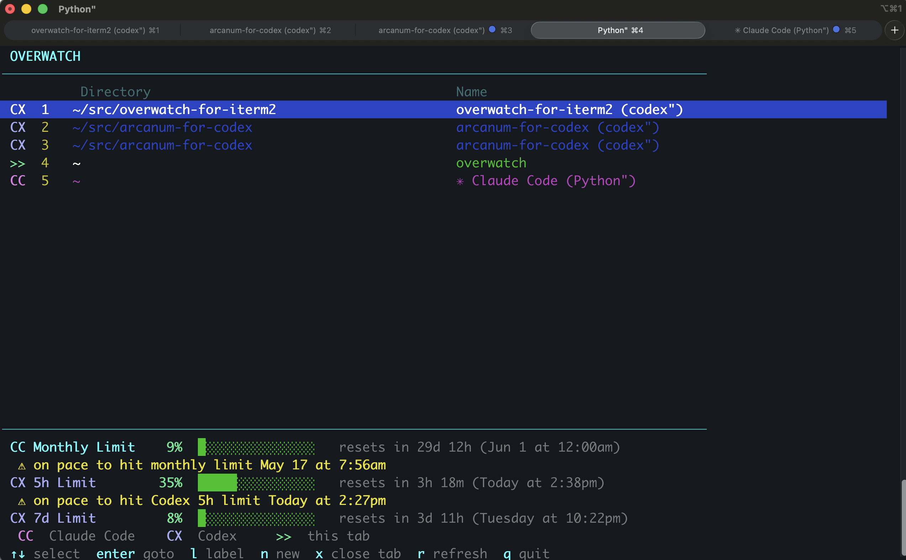

# Overwatch for iTerm2

A live terminal dashboard for your iTerm2 tabs. See every tab's working directory and session name at a glance, with special highlighting for [Claude Code](https://claude.ai/code) and [Codex](https://developers.openai.com/codex/) sessions.



## Features

- **Live tab list** — shows current directory and session name for every tab across all windows
- **AI coding agent detection** — automatically identifies tabs running Claude Code or Codex
- **Tab switching** — press Enter to jump to any tab
- **Tab labels** — press l to set a custom label for any tab, shown in yellow; clears when overwatch exits
- **New tab** — press n to open a new tab
- **Tab closing** — press x then y to close a tab (with confirmation)
- **Claude Code usage limits** — when Claude Code is running, shows available session, weekly, Sonnet, and extra-usage monthly utilization with aligned percentage bars, reset countdowns, and pace warnings
- **Codex usage limits** — when Codex is running, shows 5-hour and 7-day utilization with aligned percentage bars, reset countdowns, and pace warnings
- **Auto-refresh** — tabs update every 10 seconds, usage limits every 5 minutes, or press r to refresh everything
- **Zero dependencies** — just Python 3.7+ and macOS

## Install

```bash
# Clone
git clone https://github.com/ericburns/overwatch-for-iterm2.git

# Symlink to your PATH (always runs the latest)
ln -sf "$(pwd)/overwatch-for-iterm2/overwatch" /usr/local/bin/overwatch
```

Or just copy the single `overwatch` file anywhere on your `$PATH`.

## Usage

```
overwatch
```

### Keys

| Key | Action |
|-----|--------|
| `↑` `↓` | Navigate tabs |
| `Enter` or `g` | Switch to selected tab |
| `l` | Set or edit a label for the selected tab |
| `n` | Open a new tab |
| `x` | Close selected tab (asks for confirmation) |
| `r` | Refresh tab list and usage data |
| `q` or `Esc` | Quit overwatch |

### Tab badges

| Badge | Meaning |
|-------|---------|
| `CC` | Tab is running Claude Code (magenta) |
| `CX` | Tab is running Codex (blue) |
| `>>` | Tab running overwatch itself (green) |

### Usage footer

When supported agents are running, Overwatch displays usage rows at the bottom of the dashboard. Rows use fixed columns for the limit name, percentage, progress bar, and reset countdown so Claude Code and Codex limits line up visually.

The footer can show:

| Row | Meaning |
|-----|---------|
| `CC Session Limit` | Claude Code rolling 5-hour subscription window |
| `CC Weekly Limit` | Claude Code rolling 7-day subscription window |
| `CC Sonnet Limit` | Claude Code rolling 7-day Sonnet-specific window, when present |
| `CC Monthly Limit` | Claude Code extra-usage/token-billed monthly cap, displayed as percentage only |
| `CX 5h Limit` | Codex primary 5-hour window |
| `CX 7d Limit` | Codex secondary 7-day window |

Warnings appear below a row when current pace would hit the limit before it resets. Claude Code monthly warnings are calculated against the local calendar month and reset at local midnight on the first day of the next month.

### Codex limits

When Codex is running, Overwatch reads your local Codex OAuth token from `~/.codex/auth.json` and fetches account usage from ChatGPT's Codex usage endpoint every 5 minutes. It displays the primary 5-hour and secondary 7-day windows as progress bars with reset countdowns.

### Claude Code limits

When Claude Code is running, Overwatch reads your Claude Code OAuth token from macOS Keychain and fetches usage from Anthropic's Claude Code OAuth usage endpoint every 5 minutes. Pro/Max-style plans display rolling 5-hour and 7-day windows when available. Extra-usage or token-billed setups display the monthly spending cap as `CC Monthly Limit` with percentage-only usage, a reset countdown to local midnight on the first day of the next month, and a pace warning when current usage would exhaust the cap before month-end. Dollar amounts and cap values are intentionally not displayed.

## How it works

Overwatch uses AppleScript to query iTerm2 for tab metadata (session name, working directory, TTY) and `ps` to detect which TTYs have Claude Code or Codex processes. Claude Code usage limits are fetched from the Anthropic API using your Claude Code OAuth token (stored in macOS Keychain). Codex usage limits are fetched with your local Codex login token. Everything runs through macOS built-ins — no iTerm2 plugins or shell integration required.

## Requirements

- macOS
- iTerm2
- Python 3.7+
- Claude Code or Codex (for agent detection and usage/status features — optional)

## License

MIT
